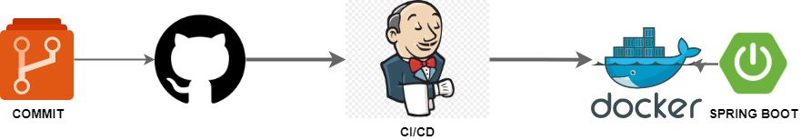

# Prueba Técnica v2 appgate - Rubén Darío Ballesteros Padilla
Repositorio prueba técnica appgate

## Calculator API REST 💻
API REST para calcular: suma, resta, multiplicación, división y potenciación de un conjunto de números.

Los servicios responden al siguiente flujo:
*	El cliente llama un servicio para empezar (Nueva sesión).
*	El cliente llama un servicio para agregar los operandos (Agregar operando), tantas veces como se quiera.
*	El cliente llama un servicio para ejecutar una operación matemática (Realizar operación).

## Propuesta Técnica
_Por la necesidad que existe de tener desacoplado las instancias y de conocer el comportamiento de los objetos se utiliza el patron de comportamiento Observer, con el cual se garantiza conocer el estado de la sesión y de esta forma al cambiar el identificador de la misma se crea un nuevo ambiente o entorno. A demas como patrón de creación o construcción se utiliza el patrón Builder, debido a que es necesario generar diferentes tipos de operaciones bajo un mismo paso a paso de contrucción y permite que el codigo pueda crecer a futuro o agregar otra operación sin afectar la totalidad de las capas del servicio. Esta propuesta se describe en el siguiente diagrama:_


## Contruido con

* [Maven](https://maven.apache.org/), para el manejo de dependencias
* [Spring Boot](https://spring.io/projects/spring-boot), Para minizar esfuerzos de configuración sobre Spring

### Build Project
_Por la forma en la que esta construido es requerido nuestro archivo de dependencias pom.xml. y ejecutar el comando Maven para su empaquetado:_

```
mvn install
```
### Docker Images

_Para contruit la image se debe ejecutar el siguiente comando:_

```
docker build -t test.appgate .
```

### Tests
_Se pueden ejecutar el conjunto de pruebas unitarias con Maven:_

```
mvn test
```


### Run Docker Container
_Esta aplicación corre por el puerto 8081 según lo definido en las configuraciones de Spring Boot y para lanzar el contenedor por consola ejecutar el comando:_

```
docker run -it -d -p 8081:8081 --name test.appgate.container test.appgate
```
### Test API REST - CURL
_Este servicio dispone de tres operaciones GET(newSession, addValue, executeOperation) y para su correcto funcionamiento el servicio debe iniciar una instancia o sesión, es por ellos que debe lanzarse primero la operación "newSession". Estas operaciones se describen a continucación:_

* **newSession:** Obtiene nueva sesion o ambiente con instancias reseteadas.
```
CURL: http://localhost:8081/calculator/newSession
```
* **addValue:** Permite agregar operandos y envia como path variable el valor del operando _{value}_.
```
CURL: http://localhost:8081/calculator/addValue/{value}
```
* **executeOperation:** Permite ejecutar las operaciones proporcionadas por e usuario y envia como path variable el valor de la operación operando _{operation}_. _valores: suma, resta, multiplicacion, division y potencia._
```
CURL: http://localhost:8081/calculator/executeOperation/{operation}
```

### Deploy
_Para este proceso se contempla un proceso de integración continua comun y simple en donde cada confirmación o publicación dispara el Pipeline Jenkins para clonar y posteriormente generar los pasos de contrucción y ejecución. Esto se describe mejor en el [Jenkinsfile](service/Jenkinsfile) y el diagrama siguiente:_ 



### Unit Test

#### Basic Cases
* División por cero
* Potenciación elevada a cero
* Potenciación elevada a valores máximos.
* Instanciación de factories y builders.
* Multiplicación
* Suma
* Resta de negativos
* Excepciones esperadas
